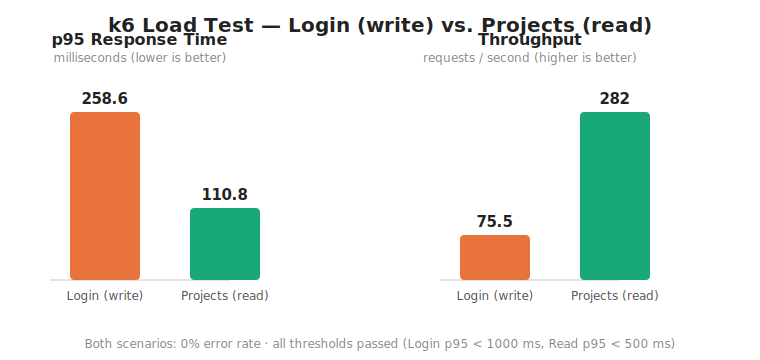

# WAT4 – Projektbericht: Planka Test Suite

## Beteiligte Personen & KI-Werkzeuge

| Name          |
|---------------|
| Tarik Merl    |
| Boban Vučetić |

**Verwendete KI-Werkzeuge:** Claude (Anthropic) – eingesetzt zur Unterstützung bei Teststruktur, Dokumentation und Code-Review.

---

## 1. Webanwendung: Planka

**Planka** ist eine selbst-hostbare, kollaborative Kanban-Board-Applikation (quelloffen, PLANKA Community License v1.1). Sie ist als Eigenhosting-Alternative zu Trello konzipiert und bietet:

- Echtzeit-Kollaboration via WebSockets (Socket.io)
- Drag-and-Drop Kanban-Boards mit Karten, Listen und Boards
- Benutzerverwaltung mit Rollen (Admin / Board-User)
- Markdown-Unterstützung in Kartenbeschreibungen, @-Mentions
- OpenID Connect SSO, 100+ Benachrichtigungsintegrationen
- Docker-basiertes Deployment

**Tech-Stack:**

| Schicht  | Technologie                            |
|----------|----------------------------------------|
| Frontend | React 18, Redux, Vite, Semantic UI React |
| Backend  | Sails.js 1.5 (Node.js), PostgreSQL 16  |
| Auth     | JWT + bcrypt                           |
| Realtime | Socket.io 4.8                          |
| Infra    | Docker, docker-compose                 |

Das Repository ist ein **Fork** des öffentlichen Upstream-Repositories [`plankanban/planka`](https://github.com/plankanban/planka). Die Upstream-Testabdeckung war minimal und unvollständig:

- **Client-Unit-Tests:** Vier Utility-Dateien ohne Tests
- **Server-Integrationstests:** Der einzige Upstream-Integrationstest (`test/integration/models/User.test.js`) war vollständig auskommentiert – Planka hatte keine funktionierenden Server-Integrationstests
- **E2E-Tests:** Nicht vorhanden
- **Load-Tests:** Nicht vorhanden

Unser Ansatz: Wir haben die fehlenden Ebenen der Testpyramide vollständig neu implementiert und dabei die erlernten Konzepte (Test-Isolation, produktionsnahe Integrationstests, CI/CD-Integration) angewandt.

---

## 2. Testpyramide – Übersicht

```
            ┌──────────────┐
            │  Load Tests  │  2 Szenarien (k6)
            └──────────────┘
          ┌────────────────────┐
          │    E2E / System    │  4 Tests (Playwright)
          └────────────────────┘
        ┌────────────────────────┐
        │   Integrationstests    │  6 Tests (Jest + supertest)
        └────────────────────────┘
      ┌──────────────────────────────┐
      │         Unit Tests           │  10 Tests (Jest)
      └──────────────────────────────┘
```

## 3. Test Frameworks

| Ebene                | Framework                  | Version  |Verwendungszweck                                   |
|----------------------|----------------------------|----------|---------------------------------------------------|
| Unit (Client)        | **Jest**                   | 30       | Utility-Funktionen im Node-Environment            |
| Integration (Server) | **Jest** + **supertest**   | 30 / 7   | HTTP-Roundtrips gegen echtes Sails + PostgreSQL   |
| E2E / System         | **Playwright**             | 1.58     | Browser-Automation (Chromium)                     |
| Load                 | **k6** (Grafana)           | latest   | Lasttests via Docker-Container                    |

---

## 4. Unit Tests (Client – Jest)

Konfiguration: [`client/jest.config.cjs`](client/jest.config.cjs) — `testEnvironment: 'node'`, `collectCoverage: true`, `clearMocks: true`. Keine Browser-API, keine Netzwerkaufrufe. Asset-Imports werden durch Stubs neutralisiert.

> **Hinweis zur Zählung:** Es gibt **10 logische Test-Funktionen** (5 pro Person, wie unten aufgelistet). Da mehrere davon mit Jests `test.each` parametrisiert sind (mehrere Eingabe/Erwartet-Paare pro Funktion), meldet `npm run test:unit` insgesamt **18 Einzelfälle**.

### 4.1 Vučetić – 5 Unit Tests

| # | Test (Datei) | Eingabe → Erwartet | Warum getestet |
|---|---|---|---|
| 1 | `isUrl` · `validator.test.js` | `'https://...'`→`true` · `'example.com'`→`false` · `'ftp://...'`→`false` | Alle Formulare nutzen diese Validierung – fehlerhafte URLs führen zu ungültigen DB-Einträgen |
| 2 | `isUsername` · `validator.test.js` | `'john.doe'`→`true` · `'ab'`→`false` · `'has space'`→`false` | Ungültige Usernamen würden Login und Mentions brechen |
| 3 | `isPassword` · `validator.test.js` | `'1234'`→`false` · `'correcthorse...'`→`true` | Sicherheitskritisch: schwache Passwörter müssen serverseitig abgelehnt werden |
| 4 | `mentionTextToMarkup` · `mentions.test.js` | `'hi @john'`→`'hi @[john](42)'` · `'hi @bob'`→`'hi @bob'` | Regex-Konvertierung ist fehleranfällig; unbekannte User dürfen nicht verändert werden |
| 5 | `mentionMarkupToText` · `mentions.test.js` | `'hi @[john](42)'`→`'hi @john'` · doppelte Mentions korrekt | Markup-Rückkonvertierung wird in jeder Kartenansicht aufgerufen |

### 4.2 Merl – 5 Unit Tests

| # | Test (Datei) | Eingabe → Erwartet | Warum getestet |
|---|---|---|---|
| 1 | `createStopwatch` · `stopwatch.test.js` | `{h:1, m:2, s:3}` → `total: 3723` | Zeitarithmetik ist Off-by-one-fehleranfällig; Korrektheit der Basis-Konvertierung sicherstellen |
| 2 | `getStopwatchParts` · `stopwatch.test.js` | `total: 3723` → `{h:1, m:2, s:3}` | Roundtrip-Konsistenz: jede Darstellung hängt von dieser Umkehrfunktion ab |
| 3 | `formatStopwatch` · `stopwatch.test.js` | `total: 3723` → `'1:02:03'` | Null-Padding-Fehler (`1:2:3` statt `1:02:03`) wären in der UI sofort sichtbar |
| 4 | Laufende Stoppuhr · `stopwatch.test.js` | 60 s banked + 3665 s FakeTimer → `'1:02:05'` | `jest.useFakeTimers()` prüft deterministisch, ob laufende Zeit korrekt addiert wird |
| 5 | `mergeRecords` + Edge Cases · `merge-records.test.js` | Merge bei gleicher ID · `null` target · keine sources | Redux-State mit falscher ID-Logik würde doppelte oder veraltete Karten anzeigen |

---

## 5. Integrationstests (Server – Jest + supertest)

Diese Schicht haben wir komplett neu implementiert (Upstream-Stand siehe Abschnitt 1). Die Tests laufen gegen ein **echtes PostgreSQL** (nicht gemockt) – Details zur produktionsnahen Isolation in Abschnitt 9.2. Konfiguration: [`server/jest.config.js`](server/jest.config.js) — `maxWorkers: 1`, `testTimeout: 30000`, `globalSetup` migriert und seeded die DB, `afterEach` truncated alle Datentabellen.

### 5.1 Merl – 3 Integrationstests (`authentication.test.js`)

| # | Test | HTTP | Warum getestet |
|---|---|---|---|
| 1 | Login mit gültigen Admin-Credentials | 200, JWT mit 3 Segmenten | Auth-Hauptpfad: ohne funktionierenden Login ist die gesamte App nicht nutzbar |
| 2 | Login mit falschem Passwort | 401, kein Token | Falsche Credentials dürfen niemals ein Token liefern |
| 3 | Unauthentifizierter Zugriff auf `GET /api/projects` | 401 | Policy-Middleware muss alle geschützten Endpoints absichern |

### 5.2 Vučetić – 3 Integrationstests (`projects.test.js`)

| # | Test | HTTP | Warum getestet |
|---|---|---|---|
| 1 | Admin legt Projekt an | 200, String-ID, 1 ProjectManager | Primäre Write-Operation; Snowflake-ID-Format und automatische Manager-Zuweisung prüfen |
| 2 | Angelegtes Projekt erscheint in der Liste | 200, Name in `items` | Read-after-write Konsistenz gegen echte DB sicherstellen |
| 3 | Non-Admin kann kein Projekt anlegen | 404 | Autorisierungslogik ist sicherheitskritisch – Board-User darf keine Admin-Aktionen ausführen |

---

## 6. E2E / System Tests (Playwright – Chromium)

Konfiguration: [`client/playwright.config.js`](client/playwright.config.js) — Chromium, `baseURL` via `E2E_BASE_URL`, Locale `en-US`, Trace on retry.

**Problem & Fix – Docker-Image-Quelle:** Das ursprüngliche `docker-compose.yml` pullte beim Start das aktuelle Upstream-Release-Image von `plankanban/planka`. Das bedeutete: E2E- und Load-Tests liefen nie gegen unseren eigenen Code, sondern gegen den unveränderten Upstream-Stand. Eigene Änderungen (z.B. neue Features, Bug-Fixes) wurden dadurch im CI gar nicht getestet. Die `docker-compose.yml` wurde so angepasst, dass der Planka-Service aus dem lokalen `Dockerfile` gebaut wird (`docker compose up --build`). Die Pipeline dauert dadurch zwar länger (Build-Schritt), testet aber garantiert unseren eigenen Code. Als direkter Folgenutzen konnten `data-testid`-Attribute in das UI eingefügt werden (z.B. `user-action-logout`, `home-add-project`), die als stabile Selektoren für Playwright dienen – etwas, das mit dem Upstream-Image nicht möglich gewesen wäre.

### 6.1 Merl – 2 E2E Tests (`auth.spec.js`)

| # | Test | Browser-Ablauf | Warum getestet |
|---|---|---|---|
| 1 | Login → Startseite | Formular ausfüllen → Submit → Admin-Name & URL `/` prüfen | Kritischster User-Flow: kein anderes Feature ist ohne Login erreichbar |
| 2 | Logout → Login-Seite | Login → User-Menu → `[data-testid="user-action-logout"]` → Formular prüfen | Session-Beendigung muss zuverlässig funktionieren; schützt vor unbefugtem Zugriff |

### 6.2 Vučetić – 2 E2E Tests

| # | Test | Browser-Ablauf | Warum getestet |
|---|---|---|---|
| 1 | Fehlermeldung bei falschen Credentials (`auth.spec.js`) | Login mit falschem PW → `/invalid credentials/i` sichtbar | UX-Anforderung: Nutzer muss verständliches Feedback bei Fehleingabe erhalten |
| 2 | Projekt über UI erstellen (`projects.spec.js`) | Login → `[data-testid="home-add-project"]` → Name → Enter → sichtbar | Erste produktive Aktion nach Login; Happy Path des Kern-Features |

---

## 7. Load Tests (k6)

k6 läuft containerisiert (`grafana/k6 --network host`) gegen den vollständigen Docker-Stack. Ergebnisse werden als JSON-Summaries exportiert und als CI-Artifacts archiviert.

| # | Datei | Art | VUs | Endpoint | Threshold p(95) | Warum getestet |
|---|---|---|---|---|---|---|
| 1 (Merl) | `login-load.js` | Write-Last | 20 | `POST /api/access-tokens` | < 1000 ms | Auth ist teuerster Endpoint (bcrypt + JWT + DB). Simultane Logins müssen stabil bleiben |
| 2 (Vučetić) | `projects-load.js` | Read-Last | 30 | `GET /api/projects` | < 500 ms | Typisches Browse-Verhalten von Teams. Token aus `setup()` geteilt – produktionsnah |

**Szenario (beide Tests):** Ramp-up 10 s → Hold 20 s → Ramp-down 5 s · Fehlerrate-Threshold: < 1 %

### 7.3 Load Test Ergebnisse & Analyse

Die Ergebnisse werden als JSON-Summaries (`load/results/*.json`) exportiert; das folgende Diagramm wird daraus reproduzierbar erzeugt (`node load/generate-chart.js`):



> Die folgenden Werte stammen aus einem lokalen Lauf (Apple Silicon, Docker Desktop). Auf einem geteilten CI-Runner fällt der absolute Durchsatz niedriger aus; die **Verhältnisse** zwischen Write- und Read-Last bleiben aber vergleichbar.

**Vergleich beider Szenarien** (lokaler Lauf, beide **0 % Fehlerrate**, alle Checks bestanden):

| Metrik              | Login (Write, 20 VUs) | Projects (Read, 30 VUs) | Verhältnis           |
|---------------------|-----------------------|-------------------------|----------------------|
| Avg. Antwortzeit    | ~209 ms               | ~84 ms                  | ~2,5× langsamer      |
| p95 Antwortzeit     | ~259 ms               | ~111 ms                 | ~2,3× langsamer      |
| Durchsatz           | ~75 req/s             | ~282 req/s              | Read ~3,7× schneller |
| Requests (in 35 s)  | 2.646                 | 9.890                   | —                    |
| Threshold (p95)     | ✓ < 1000 ms           | ✓ < 500 ms              | beide bestanden      |

**Analyse:**

Der Unterschied zwischen Login- und Read-Endpoint ist primär auf das **bcrypt-Passwort-Hashing** zurückzuführen – ein intentionales Security-Feature (der Cost-Factor erhöht die Berechnungszeit per Design). Trotzdem bleibt der Login bei 20 parallelen VUs mit einem p95 von ~259 ms weit unter dem 1000 ms-Schwellwert; der Server bedient simultane Logins also ohne Degradation. Der niedrigere Durchsatz (~75 req/s gegenüber ~282 req/s beim Read) ist die direkte Folge der teureren Berechnung pro Request.

Der Read-Endpoint (`GET /api/projects`) zeigt das erwartete Verhalten einer gut indexierten Datenbankabfrage: bei sogar 30 VUs liegt der p95 bei nur ~111 ms, klar unter dem 500 ms-Schwellwert, bei ~282 req/s. Die Fehlerrate ist in beiden Szenarien **0 %**, was Stabilität unter Last bestätigt.

Fazit: Beide kritischen Pfade (Authentifizierung und Daten-Read) skalieren im getesteten Bereich stabil und schnell. Die Werte sind repräsentativ für Team-Größen von mehreren Dutzend gleichzeitiger Nutzer; der bcrypt-bedingte Login-Overhead ist ein bewusster Sicherheits-Trade-off, kein Performance-Problem.

---

## 8. Test Setup & Konfiguration

### 8.1 Verzeichnisstruktur der Tests

```
wat4-g1-planka-vucetic-merl/
├── .github/workflows/
│   └── tests.yml                  # Haupt-CI-Pipeline (4 Jobs)
├── client/
│   ├── jest.config.cjs            # Unit-Test-Konfiguration
│   ├── playwright.config.js       # E2E-Konfiguration
│   └── src/utils/
│       ├── validator.test.js      # Unit (Vučetić)
│       ├── mentions.test.js       # Unit (Vučetić)
│       ├── stopwatch.test.js      # Unit (Merl)
│       └── merge-records.test.js  # Unit (Merl)
│   └── tests/
│       └── e2e/
│           ├── auth.spec.js       # E2E: Login/Logout/Error
│           ├── projects.spec.js   # E2E: Projekt erstellen
│           └── support/login.js   # Shared Login-Helper
├── server/
│   ├── jest.config.js             # Integration-Test-Konfiguration
│   └── test/
│       ├── jest/
│       │   ├── global-setup.js    # DB-Migration, Sails-Lift, Seeding
│       │   └── global-teardown.js # Sails-Lower
│       ├── support/
│       │   ├── auth.js            # supertest-Agent, login(), getToken()
│       │   ├── db.js              # clearData() – TRUNCATE nach jedem Test
│       │   ├── fixtures.js        # ADMIN + MEMBER Credentials
│       │   └── jest-hooks.js      # afterEach: clearData()
│       └── api/
│           ├── authentication.test.js  # Integration (Merl)
│           └── projects.test.js        # Integration (Vučetić)
├── load/
│   ├── login-load.js              # k6 Login-Last (Merl)
│   └── projects-load.js           # k6 Read-Last (Vučetić)
├── docker-compose.yml             # Full Stack (E2E + Load)
└── docker-compose.test.yml        # Nur PostgreSQL (lokale Integration)
```

### 8.2 Test-Skripte (root `package.json`)

```json
{
  "test":               "npm run test:unit && npm run test:integration",
  "test:unit":          "npm run test:unit --prefix client",
  "test:integration":   "npm run test:integration --prefix server",
  "test:e2e":           "npm run test:e2e --prefix client",
  "test:load":          "k6 run load/login-load.js && k6 run load/projects-load.js",
  "test:load:login":    "k6 run load/login-load.js",
  "test:load:projects": "k6 run load/projects-load.js",
  "stack:up":           "docker compose up -d --wait",
  "stack:down":         "docker compose down -v",
  "test:db:up":         "docker compose -f docker-compose.test.yml up -d --wait",
  "test:db:down":       "docker compose -f docker-compose.test.yml down -v"
}
```

> Lokal nutzen die `test:load:*`-Scripts das lokal installierte **k6-Binary** (`brew install k6`); in der CI läuft k6 stattdessen **containerisiert** (`docker run grafana/k6`), um keine Binary installieren zu müssen.

---

## 9. Test Isolation

### 9.1 Unit Tests (Client)

- **Umgebung:** Reines Node.js – kein DOM, kein Netzwerk, keine externen Abhängigkeiten
- **Isolation:** Jeder Test ist eine pure Funktion ohne Seiteneffekte
- **Fake-Timer:** `jest.useFakeTimers()` in Stopwatch-Tests für deterministisches Zeitverhalten (kein echtes `Date.now()`)
- **Mock-Reset:** `clearMocks: true` – alle Mock-Zustände werden zwischen Tests zurückgesetzt
- **Asset-Stubs:** CSS/Bild-Imports werden über `moduleNameMapper` durch Stubs ersetzt

### 9.2 Integrationstests (Server)

**Global Setup** (`server/test/jest/global-setup.js`) – läuft **einmalig** vor der gesamten Suite:

1. `NODE_ENV=test` setzen
2. `DATABASE_URL` aus Umgebung lesen (Default: `localhost:5432/planka_test`)
3. Knex-Migrationen ausführen (`knex.migrate.latest()`) – idempotent
4. Baseline-Seed ausführen (Admin-User, InternalConfig)
5. Bestehende Datentabellen leeren (Überreste von vorigen Runs)
6. Sails-Anwendung hochfahren (`sails.lift()`)
7. Admin-User für Login vorbereiten (Terms-Signature, `isInitialized=true`)
8. MEMBER-User anlegen (für Autorisierungstests)
9. `TEST_BASE_URL` für Worker-Prozesse exportieren

**Per-Test Cleanup** (`server/test/support/jest-hooks.js`):

```js
afterEach(async () => clearData());  // TRUNCATE aller Datentabellen
```

```sql
-- Ausgeführt nach jedem Test:
TRUNCATE TABLE "board", "card", "list", "project", ... RESTART IDENTITY CASCADE
-- Beibehaltene Tabellen (Baseline): migration, user_account, internal_config
```

**Isolation-Garantien:**
- `maxWorkers: 1` – serielle Ausführung verhindert Race Conditions auf der geteilten Sails-Instanz
- Jeder Test startet mit exakt definierten Baseline-Daten (2 User, keine Projekte/Boards/Cards)
- String-IDs (Snowflake), echte DB-Constraints, echtes bcrypt = produktionsnah

### 9.3 E2E Tests (Playwright)

- **Stack-Isolation:** Frischer Docker-Stack pro CI-Run (`docker compose up --build --wait`)
- **Image-Quelle:** Lokaler Build aus eigenem `Dockerfile` (kein Upstream-Release-Image) – siehe Abschnitt 6 für Hintergrund und Fix
- **Browser-Isolation:** Eigener Playwright-Prozess pro Worker, eigene Browser-Session
- **Determinismus:** Locale `en-US`, `data-testid`-Attribute statt fragile CSS-Selektoren

### 9.4 Load Tests (k6)

- **Stack:** Vollständiger Docker-Stack aus lokalem Quellcode
- **k6-Container:** Läuft vollständig containerisiert (`--network host`), keine lokalen Node-Abhängigkeiten
- **Zustand:** Demo-Admin wird vor jedem Load-Run per Script initialisiert (`scripts/accept-terms.sh`)
- **Ergebnis-Export:** JSON-Summaries per `--summary-export` für CI-Artifact-Upload

---

## 10. CI/CD Pipeline

**Datei:** [`.github/workflows/tests.yml`](.github/workflows/tests.yml)

**Trigger:** Push auf `master`, Pull Requests auf `master`, manuell (`workflow_dispatch`)

```
Push / PR auf master
        │
        ▼
┌───────────────────────────────────────────────────────────────┐
│                   GitHub Actions: Tests                       │
│                                                               │
│  ┌──────────┐ ┌──────────────┐ ┌──────────┐ ┌──────────┐      │
│  │  unit    │ │ integration  │ │   e2e    │ │   load   │      │
│  │          │ │              │ │          │ │          │      │
│  │ Node 22  │ │ Node 22      │ │ Node 22  │ │ Docker   │      │
│  │ Jest     │ │ Jest +       │ │Playwright│ │ k6       │      │
│  │          │ │ supertest    │ │ Chromium │ │          │      │
│  │          │ │ + PG 16      │ │ + full   │ │ + full   │      │
│  │          │ │ (Service)    │ │ stack    │ │ stack    │      │
│  └────┬─────┘ └──────┬───────┘ └────┬─────┘ └────┬─────┘      │
│       │              │              │            │            │
│       ▼              ▼              ▼            ▼            │
│  client-coverage  (console)  playwright-   k6-load-           │
│  (Artifact 14d)              report        summaries          │
│                              (Artifact     (Artifact          │
│                               14d)          14d)              │
└───────────────────────────────────────────────────────────────┘
```

### Job-Details

Vollständige Definition siehe [`tests.yml`](.github/workflows/tests.yml); kompakt zusammengefasst:

- **`unit`** — `npm ci` + `npm run test:unit`; lädt `client/coverage` als Artifact.
- **`integration`** — PostgreSQL 16 als nativer GitHub-Actions-**Service-Container** (kein Docker-in-Docker, Healthcheck vor Teststart); `npm run test:integration`, dessen `globalSetup` die DB migriert und seedet.
- **`e2e`** — baut den Stack aus eigenem Code (`docker compose up -d --build`), installiert Playwright-Chromium, `npm run test:e2e`; lädt `playwright-report`.
- **`load`** — Stack + `scripts/accept-terms.sh`, dann k6 containerisiert (`grafana/k6`) für beide Szenarien; lädt die JSON-Summaries.

Alle vier Jobs laufen parallel; Artifacts werden **14 Tage** aufbewahrt, die Docker-Stacks via `docker compose down -v` (`if: always()`) aufgeräumt.

### Weitere Workflows

Die aus dem Upstream geerbten Workflows wurden für unseren Fork **deaktiviert** (Trigger auf `workflow_dispatch`, also nur noch manuell), da sie self-hosted Runner bzw. Registry-/Publish-Zugriff voraussetzen und sonst im Actions-Tab nur fehlschlagen würden. Die Dateien bleiben als Referenz erhalten.

| Workflow             | Datei                                     | Zweck                           | Status (Fork)            |
|----------------------|-------------------------------------------|---------------------------------|--------------------------|
| Lint                 | `lint.yml`                                | ESLint auf Pull Requests        | **aktiv**                |
| Build and Test (alt) | `build-and-test.yml`                      | Upstream-Cucumber-Tests         | deaktiviert (ersetzt durch `tests.yml`) |
| Docker Build & Push  | `build-and-push-docker-image.yml`         | Release-Images bauen und pushen | deaktiviert (manuell)    |
| Docker Nightly       | `build-and-push-docker-nightly-image.yml` | Nächtliche Builds               | deaktiviert (manuell)    |
| Release Package      | `build-and-publish-release-package.yml`   | Release Artifacts               | deaktiviert (manuell)    |
| Release Helm Chart   | `release-helm-chart.yml`                  | Helm-Chart-Release              | deaktiviert (manuell)    |

---

## 11. Coverage

**Client Unit Test Coverage** (automatisch durch Jest):

Coverage wird für die vier getesteten Utility-Module gemessen und als HTML/JSON-Report in `client/coverage/` gespeichert:

| Datei                        | Statements | Branches | Functions | Lines  |
|------------------------------|------------|----------|-----------|--------|
| `src/utils/validator.js`     | 100 %      | 100 %    | 100 %     | 100 %  |
| `src/utils/mentions.js`      | 92,3 %     | 100 %    | 80 %      | 100 %  |
| `src/utils/stopwatch.js`     | 86,4 %     | 37,5 %   | 62,5 %    | 100 %  |
| `src/utils/merge-records.js` | 100 %      | 100 %    | 100 %     | 100 %  |

Der HTML-Report liegt unter `client/coverage/` und wird in CI als `client-coverage`-Artifact hochgeladen.

**Server / E2E / Load:** Keine Quellcode-Coverage – diese Ebenen messen API-Verhalten, Feature-Korrektheit und Performance, nicht Code-Pfade.
